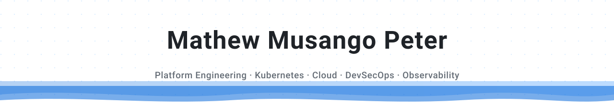

<!-- Generated by scripts/build_readme.py — edit the script, not this file. -->

  <picture>
    <source media="(prefers-color-scheme: dark)" srcset="assets/svg/header.svg">
    
  </picture>
   
   &nbsp;&nbsp;  &nbsp;&nbsp; 

<table align="center"><tr><th align="center" valign="top"><picture>
    <source media="(prefers-color-scheme: dark)" srcset="assets/svg/icons/gear.svg">
    
  </picture> TOOLS</th></tr><tr><td align="center" valign="top" width="520">
    
    
    
    
    <picture>
    <source media="(prefers-color-scheme: dark)" srcset="https://cdn.simpleicons.org/podman/caa0d4">
    
  </picture>
    
    
    
    
    
    <picture>
    <source media="(prefers-color-scheme: dark)" srcset="https://cdn.simpleicons.org/centos/9d9dc2">
    
  </picture>
    
    
    <picture>
    <source media="(prefers-color-scheme: dark)" srcset="https://cdn.simpleicons.org/qnap/92a1c7">
    
  </picture>
    
    
    <picture>
    <source media="(prefers-color-scheme: dark)" srcset="https://cdn.simpleicons.org/pfsense/9b9b9b">
    
  </picture>
    <picture>
    <source media="(prefers-color-scheme: dark)" srcset="https://cdn.simpleicons.org/wireguard/c99798">
    
  </picture>
    
    
    
    
    
    <picture>
    <source media="(prefers-color-scheme: dark)" srcset="https://cdn.simpleicons.org/helm/9396ca">
    
  </picture>
    
    
    <picture>
    <source media="(prefers-color-scheme: dark)" srcset="https://cdn.simpleicons.org/trivy/988eee">
    
  </picture>
    
    <picture>
    <source media="(prefers-color-scheme: dark)" srcset="https://cdn.simpleicons.org/github/979797">
    
  </picture>
    
    
    
    
    <picture>
    <source media="(prefers-color-scheme: dark)" srcset="https://cdn.simpleicons.org/icinga/8f8fa0">
    
  </picture>
    <picture>
    <source media="(prefers-color-scheme: dark)" srcset="https://cdn.simpleicons.org/elasticsearch/8cb2bf">
    
  </picture>
    <picture>
    <source media="(prefers-color-scheme: dark)" srcset="https://cdn.simpleicons.org/kibana/8cb2bf">
    
  </picture>
    <picture>
    <source media="(prefers-color-scheme: dark)" srcset="https://cdn.simpleicons.org/logstash/8cb2bf">
    
  </picture>
    </td></tr></table>

<table align="center"><tr><th align="center" valign="top"><picture>
    <source media="(prefers-color-scheme: dark)" srcset="assets/svg/icons/brackets.svg">
    
  </picture> LANGUAGES</th></tr><tr><td align="center" valign="top">
    
    <picture>
    <source media="(prefers-color-scheme: dark)" srcset="https://cdn.simpleicons.org/css/baa3d1">
    
  </picture>
    
    <picture>
    <source media="(prefers-color-scheme: dark)" srcset="https://cdn.simpleicons.org/markdown/8c8c8c">
    
  </picture></td></tr></table>

  <picture>
    <source media="(prefers-color-scheme: dark)" srcset="assets/svg/footer.svg">
    
  </picture>

